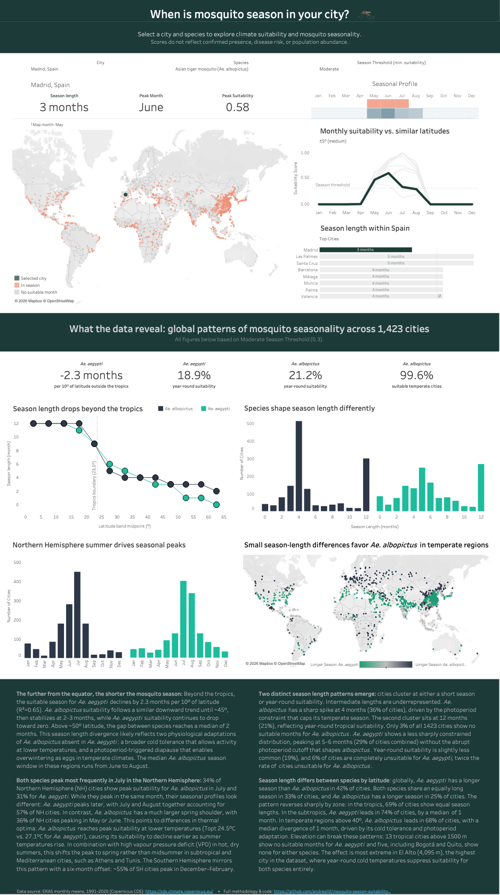

# When is mosquito season in your city?
### Climate suitability for *Ae. aegypti* and *Ae. albopictus* across 1,421 cities worldwide

> **Tableau Public dashboard** · **ERA5 climate data** · **1991–2020 climate normals**

[](https://public.tableau.com/app/profile/andr.s.lill8311/viz/Whenismosquitoseasoninyourcity/Dashboard)
[](https://github.com/andreslill/mosquito-season-suitability/blob/main/data/mosquito_suitability.csv)
[
[

---

In 2025, Europe recorded simultaneous locally acquired dengue, chikungunya, and West Nile virus transmission for the first time (Simonin 2025; ECDC 2025). *Ae. albopictus* has rapidly expanded into temperate regions over recent decades (Bonizzoni et al. 2013), shifting the key question from **where** climate is suitable to **when** seasonal conditions favour mosquito activity. This project models those seasonal suitability windows for *Ae. aegypti* and *Ae. albopictus* across 1,421 cities worldwide using 1991–2020 climate normals.

**Important:** Scores represent *climate suitability only*, not confirmed mosquito presence, disease risk, or actual population abundance. City level elevation is included as contextual information. Elevation differences within cities, microclimates, urban heat islands, and local habitat availability are not captured.

---

## Dashboard Preview

[](https://public.tableau.com/app/profile/andr.s.lill8311/viz/Whenismosquitoseasoninyourcity/Dashboard?publish=yes)
*Screenshot of the Tableau Public dashboard showing Mexico City (Ae. albopictus, Moderate threshold). Select any city and species to explore seasonal suitability, and regional comparisons.*

---

## Suitability Model

Suitability is a multiplicative score (0–1):

```
Suitability Score (*Ae. aegypti*)    = TempScore × VPDScore
Suitability Score (*Ae. albopictus*) = TempScore × VPDScore × PhotoFactor*

*PhotoFactor = 1.0 within the tropics (|lat| < ~23.5°); decreases continuously at higher latitudes.
```

### Temperature suitability (TempScore)
Triangular thermal curve: 0 at Tmin/Tmax, 1 at Topt, linear between.

Parameters from Doeurk et al. 2025 (female adult survival):

| Species | Tmin (°C) | Topt (°C) | Tmax (°C) |
|---|---|---|---|
| *Ae. aegypti* | 14.97 | 27.1 | 39.15 |
| *Ae. albopictus* | 11.02 | 24.5 | 38.07 |

### Desiccation stress 
Linear from 1.0 (VPD ≤ 1.0 kPa) to 0.0 (VPD ≥ 3.0 kPa), following Schmidt et al. 2018. VPD derived from ERA5 temperature and dewpoint via the Magnus approximation.

### Photoperiod (PhotoFactor • *Ae. albopictus* only)
A sigmoid function (inflection = 23.5°, k = 0.5) weights the Lacour et al. 2015 photoperiod thresholds (11.25 h / 13.5 h) continuously by latitude, producing a 
~5° transition zone around the Tropic of Cancer/Capricorn. PhotoFactor approaches 1.0 near the equator and 0.0 at high latitudes in winter.

### Precipitation
Precipitation is shown as contextual information only and does not contribute to the suitability score. 

---

## Data Sources

| Dataset | Source | Period | Notes |
|---|---|---|---|
| Climate normals | ERA5 monthly means [Hersbach et al. 2023](https://doi.org/10.24381/cds.f17050d7) | 1991–2020 | WMO standard period |
| City list | [SimpleMaps World Cities Basic v1.901](https://simplemaps.com/data/world-cities) | 2024 | Filtered: population ≥ 500,000. License: CC BY 4.0 |
| Elevation | [Open-Elevation API](https://open-elevation.com) | — | City-level, metres above sea level |

---

## Model Validation

Suitability scores were compared against occurrence records from Kraemer et al. (2015), a global compendium of 42,066 Ae. aegypti and Ae. albopictus records. Cities with confirmed records within 50 km showed systematically higher suitability than absence-labelled cities. Season length was the strongest discriminator:

| Species | Metric | Presence median | Absence-labelled median | AUC |
|---|---|---|---|---|
| *Ae. aegypti* | Season length (≥ 0.2) | 12 months | 6 months | **0.834** |
| *Ae. aegypti* | Season length (≥ 0.3) | 12 months | 5 months | 0.827 |
| *Ae. aegypti* | Season length (≥ 0.4) | 12 months | 5 months | 0.815 |
| *Ae. albopictus* | Season length (≥ 0.2) | 12 months | 6 months | **0.743** |
| *Ae. albopictus* | Season length (≥ 0.3) | 12 months | 5 months | 0.730 |
| *Ae. albopictus* | Season length (≥ 0.4) | 12 months | 4 months | 0.747 |

All Mann-Whitney U tests: p < 0.001. 
Full methodology and validation: [`notebooks/methodology_and_validation.ipynb`](https://github.com/andreslill/mosquito-season-suitability/blob/main/notebooks/methodology_and_validation.ipynb)

---

## Repository Structure

```
├── analysis/
│   └── photoperiod_sensitivity_check.py      # Sigmoid vs. binary cutoff sensitivity check
├── assets/
│   └── dashboard_screenshot.png  
├── data/
│   └── mosquito_suitability.csv              # Pre-computed dataset (1,421 cities × 12 months)
│   └── kraemer_occurrences.csv               # Pre-processed from Kraemer et al. (2015); used for validation
├── notebooks/
│   ├── mosquito_suitability_pipeline.ipynb   # ERA5 data pipeline and suitability model
│   └── methodology_and_validation.ipynb      # Validation, discussion, and model limitations
├── .gitattributes
├── requirements.txt
└── README.md
```
---

## Reproducing the Data Pipeline

**Requirements:** Python 3.10+, and the following packages: `numpy`, `pandas`, `xarray`, `tqdm`, plus CDS API access.

The processed output (mosquito_suitability.csv) is included in the repository. Running the full pipeline is only necessary if you want to reproduce or modify the data processing steps.

**ERA5 download:**
1. Register at [cds.climate.copernicus.eu](https://cds.climate.copernicus.eu)
2. Accept the ERA5 license
3. Download `reanalysis-era5-single-levels-monthly-means`, variables: `2m_temperature`, `2m_dewpoint_temperature`, `total_precipitation`, period 1991–2020

**Run:**
1. Open `mosquito_suitability_pipeline.ipynb` in Google Colab
2. Update the file paths in the CONFIG section (Section 2 and Section 4) to match your local environment or Google Drive mount point
3. Run all cells sequentially (note: ERA5 data is returned in Kelvin and m/day. Unit conversion is handled in the notebook)
4. The pipeline generates a Tableau-ready CSV (city × month).

---

## References

>Bonizzoni M, et al. The invasive mosquito species *Aedes albopictus*: current knowledge and future perspectives. Trends Parasitol. 2013; 29(9):460–468. https://doi.org/10.1016/j.pt.2013.07.003

>Doeurk S, et al. Impact of temperature on survival, development and longevity of *Ae. aegypti* and *Ae. albopictus*. Parasites & Vectors 2025; 18:362. https://doi.org/10.1186/s13071-025-06892-y

>Hersbach, H., et al. (2023). ERA5 monthly averaged data on single levels from 1940 to present. Copernicus Climate Change Service (C3S) Climate Data Store (CDS). https://doi.org/10.24381/cds.f17050d7

>Kraemer MUG, et al. The global compendium of *Aedes aegypti* and *Ae. albopictus* occurrence. Sci Data 2015; 2:150035. https://doi.org/10.1038/sdata.2015.35

>Lacour G, et al. Seasonal Synchronization of Diapause Phases in *Aedes albopictus* (Diptera: Culicidae). PLOS ONE 2015; 10(12): e0145311. https://doi.org/10.1371/journal.pone.0145311

>Mordecai EA, et al. Detecting the impact of temperature on transmission of Zika, dengue, and chikungunya using mechanistic models. PLOS Neglected Tropical Diseases 2017; 11(4): e0005568. https://doi.org/10.1371/journal.pntd.0005568

>Schmidt CA, et al. Effects of desiccation stress on adult female longevity in *Ae. aegypti* and *Ae. albopictus*. Parasites & Vectors 2018; 11:267. https://doi.org/10.1186/s13071-018-2808-6

>Simonin Y. Europe Faces Multiple Arboviral Threats in 2025. Viruses 2025; 17:1642. https://doi.org/10.3390/v17121642

---

## Author

Andrés Lill · 2026  
