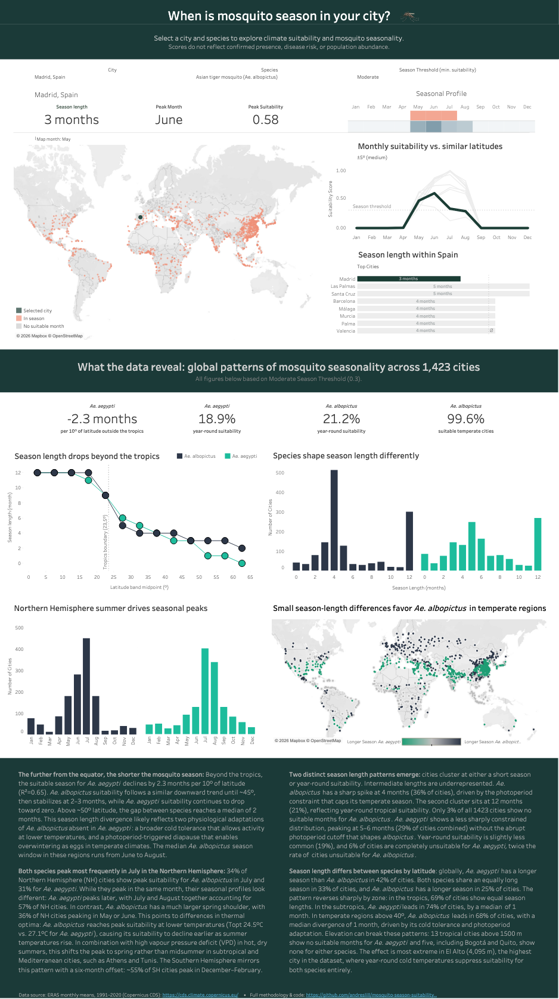

# When is mosquito season in your city?
### Climate suitability for *Ae. aegypti* and *Ae. albopictus* across 1,423 cities worldwide

> **Tableau Public dashboard** · **ERA5-Land climate data** · **1991–2020 climate normals**

[](https://public.tableau.com/app/profile/andr.s.lill8311/viz/Whenismosquitoseasoninyourcity_v2/Whenismosquitoseasoninyourcity?publish=yes)
[](https://github.com/andreslill/mosquito-season-suitability/blob/main/data/mosquito_suitability.csv)
[](https://github.com/andreslill/mosquito-season-suitability/blob/main/notebooks/mosquito_suitability_pipeline.ipynb)
[](https://github.com/andreslill/mosquito-season-suitability/blob/main/notebooks/methodology_and_validation.ipynb)

---

Using ERA5-Land 1991–2020 climate normals, this model estimates when monthly climate conditions favour activity of Ae. aegypti and Ae. albopictus across 1,423 cities worldwide. For each city, it estimates the number of months per year in which conditions are simultaneously favourable, and which month peaks. As Ae. albopictus has expanded into temperate regions over recent decades, the question shifts from where climate is suitable to when seasonal conditions are favourable.

For *Ae. albopictus*, the final score separates baseline monthly climate suitability from a residual Adult Persistence Tail after critical photoperiod crossing, to better reflect late-season adult activity observed in field studies.

**Important:** Scores represent climate suitability and, for *Ae. albopictus*, modelled residual adult persistence. They do not represent confirmed mosquito presence, disease risk, or actual population abundance.

---

## Dashboard Preview

[](https://public.tableau.com/app/profile/andr.s.lill8311/viz/Whenismosquitoseasoninyourcity_v2/Whenismosquitoseasoninyourcity?publish=yes)
*Screenshot of the Tableau Public dashboard showing Madrid, Spain (Ae. albopictus, Moderate threshold). Select any city and species to explore seasonal suitability, and regional comparisons.*

---

## Suitability Model

Baseline suitability is computed as a multiplicative score (0–1). For *Ae. albopictus*, the final score additionally includes the Adult Persistence Tail:

**Ae. aegypti:**
```
suitability_score_aegypti = TempScore × VPDScore
```

**Ae. albopictus (baseline):**
```
suitability_score_albopictus_base = TempScore × VPDScore × PhotoFactor
```

**Ae. albopictus (final):**
```
suitability_score_albopictus = max(suitability_score_albopictus_base, adult_persistence_tail)
```

The Adult Persistence Tail is applied only after critical photoperiod crossing and only for *Ae. albopictus*. It represents residual adult activity, not new larval development or full monthly climatic suitability.

### Temperature suitability (TempScore)
Triangular thermal curve: 0 at Tmin/Tmax, 1 at Topt, linear between.

Parameters from Doeurk et al. 2025 (female adult survival):

| Species | Tmin (°C) | Topt (°C) | Tmax (°C) |
|---|---|---|---|
| *Ae. aegypti* | 14.97 | 27.1 | 39.15 |
| *Ae. albopictus* | 11.02 | 24.5 | 38.07 |

### Desiccation stress (VPDScore)
Linear from 1.0 (VPD ≤ 1.0 kPa) to 0.0 (VPD ≥ 3.0 kPa), following Schmidt et al. 2018. VPD derived from ERA5-Land temperature and dewpoint via the Magnus approximation.

### Photoperiod (PhotoFactor · *Ae. albopictus* only)
A continuous two-stage model. First, a sigmoid latitude weight (inflection = 23.5°, k = 0.5) determines how strongly photoperiod modulates suitability at a given latitude, approaching 0 near the equator and 1 at high latitudes. Second, a logistic photoperiod response (steepness = 8.0) is centred on a latitude-dependent critical photoperiod (CPP), interpolated linearly from 12.3 h at 25° absolute latitude (Xia et al. 2018) to 13.5 h at 40° (Lacour et al. 2015).

### Adult Persistence Tail (*Ae. albopictus* only)
Field studies consistently report late-season adult activity and oviposition after direct monthly climate suitability has already declined below season thresholds. To separate baseline climate suitability from residual adult activity, the model adds an Adult Persistence Tail after critical photoperiod crossing.

```
adult_persistence_tail = S_cpp × exp(−days_since_cpp / tau)
S_cpp = q_persistence_start × TempScore_cpp_month × VPDScore_cpp_month
```

`tau` is derived from an empirical temperature-dependent lag regression calibrated against field-observed season endpoints across 28 Northern Hemisphere sites (photoperiod_lag_analysis.ipynb; WLS R² = 0.481). The main calibrated value is `q_persistence_start = 0.75`. Sensitivity analysis across q ∈ {0.50, 0.75, 1.00} is documented in `adult_persistence_tail_method_assessment.ipynb`. The Adult Persistence Tail is applied to Northern Hemisphere cities only.

### Precipitation
Precipitation is shown as contextual information only and does not contribute to the suitability score.

---

## Data Sources

| Dataset | Source | Period | Notes |
|---|---|---|---|
| Climate normals | ERA5-Land monthly means [Muñoz-Sabater 2019](https://doi.org/10.24381/cds.68d2bb30) | 1991–2020 | WMO standard period |
| City list | [SimpleMaps World Cities Basic v1.901](https://simplemaps.com/data/world-cities) | 2024 | Population ≥ 500,000; plus Funchal and Nicosia as special-interest cities. CC BY 4.0 |
| Elevation | [Open-Elevation API](https://open-elevation.com) | — | City-level, metres above sea level |
| Curated occurrence validation | Kraemer et al. 2015, 2017 | 1958–2014 | 42,066 point records; primary occurrence validation |
| Field endpoint table | Manually curated from published literature | 2003–2026 | 33 endpoint rows; primary late-season endpoint validation |
| GBIF / VectorNet | GBIF.org; VectorNet | 2015–2026 / 2002–2022 | Exploratory reporting-bias check only; not treated as true-absence validation |

---

## Validation Summary

Suitability scores were validated against curated occurrence records from Kraemer et al. (2015, 2017), a global compendium of 42,066 *Ae. aegypti* and *Ae. albopictus* records. Cities with confirmed records within 50 km showed systematically higher suitability than pseudo-absence-labelled cities. Season length was the strongest discriminator.

### Primary occurrence validation: Kraemer et al. (2015, 2017)

| Species | Metric | Presence median | Pseudo-absence median | AUC | 95% CI |
|---|---|---|---|---|---|
| *Ae. aegypti* | Season length (Early, ≥ 0.2) | 12 months | 6 months | **0.84** | 0.81–0.87 |
| *Ae. aegypti* | Season length (Moderate, ≥ 0.3) | 12 months | 5 months | 0.82 | 0.78–0.87 |
| *Ae. aegypti* | Season length (Strict, ≥ 0.4) | 12 months | 5 months | 0.82 | 0.77–0.86 |
| *Ae. albopictus* | Season length (Early, ≥ 0.2) | 12 months | 7 months | **0.74** | 0.65–0.83 |
| *Ae. albopictus* | Season length (Moderate, ≥ 0.3) | 12 months | 6 months | 0.74 | 0.64–0.83 |
| *Ae. albopictus* | Season length (Strict, ≥ 0.4) | 10 months | 5 months | 0.74 | 0.64–0.82 |

All Mann-Whitney U tests: p < 0.001. Results are broadly stable across matching radii from 50 to 150 km and between full and pre-2014 record subsets; discrimination is lower at the 25 km radius for *Ae. albopictus*, where only seven presence cities remain.

Additional metrics including peak score and mean active-month score are reported in the validation notebook.

### Field endpoint validation: seasonal realism

A manually curated field-endpoint table was used to compare observed *Ae. albopictus* seasonal activity endpoints with modelled end months at the moderate threshold (≥ 0.3). The table contains 33 endpoint rows from published studies; where exact study locations were not included in the 1,423-city model set, the `Model city used` column documents the validation-only proxy city. Proxy matching does not alter model outputs.

In the method assessment, the Adult Persistence Tail reduced mean absolute endpoint error from approximately 1.75 to 1.13 months across the matched endpoint comparisons, with 20 matched endpoints improved, 12 unchanged, and none worsened.

### Exploratory GBIF / VectorNet check

GBIF and VectorNet were explored as additional occurrence sources. GBIF-derived non-detections were not treated as true absences. For *Ae. albopictus*, GBIF pseudo-absence labels were strongly affected by reporting effort and included many climatically suitable cities without nearby records. These results are therefore reported as an exploratory reporting-bias check only and not as primary model performance evidence.

Full methodology and validation: [`notebooks/methodology_and_validation.ipynb`](https://github.com/andreslill/mosquito-season-suitability/blob/main/notebooks/methodology_and_validation.ipynb)

---

## Repository Structure

```
├── assets/
│   └── dashboard_screenshot.png
├── data/
│   ├── mosquito_suitability.csv                        # Final dataset (1,423 cities × 12 months = 17,076 rows)
│   ├── mosquito_suitability_delta.csv                  # Season length change: 1961–1990 vs. 1991–2020
│   ├── kraemer_occurrences.csv                         # Pre-processed from Kraemer et al. (2015); used for validation
│   ├── worldcities.csv                                 # SimpleMaps Basic World Cities (CC BY 4.0)
│   └── Validated_Season_Table_clean_model_city_used.csv # Field endpoint table (33 endpoint rows)
├── notebooks/
│   ├── mosquito_suitability_pipeline.ipynb             # ERA5-Land pipeline + full suitability model incl. Adult Persistence Tail
│   ├── photoperiod_lag_analysis.ipynb                  # Post-CPP lag regression (calibration, n=28 sites)
│   ├── extract_city_postcpp_T.ipynb                    # ERA5-Land post-CPP temperature extraction for all dashboard cities
│   ├── adult_persistence_tail_method_assessment.ipynb  # Method assessment: parameter sensitivity and guardrail checks
│   ├── methodology_and_validation.ipynb                # Validation, discussion, and model limitations
│   ├── mosquito_climate_change_delta.ipynb             # Climate change delta (1961–1990 vs. 1991–2020)
│   └── photoperiod_parameter_selection.ipynb           # CPP parameter selection and decision log
├── requirements.txt
└── README.md
```

---

## Reproducing the Data Pipeline

**Requirements:** Python 3.10+, packages: `numpy`, `pandas`, `xarray`, `tqdm`, `requests`, plus CDS API access.

The processed output (`mosquito_suitability.csv`) is included in the repository. Running the full pipeline is only necessary if you want to reproduce or modify the data processing steps.

**Important:** Use `city + country` as the unique city identifier — city names alone are not globally unique.

**ERA5-Land download:**
1. Register at [cds.climate.copernicus.eu](https://cds.climate.copernicus.eu)
2. Accept the ERA5-Land license
3. Download `reanalysis-era5-land-monthly-means`, variables: `2m_temperature`, `2m_dewpoint_temperature`, `total_precipitation`, period 1991–2020

### Recommended notebook execution order

| Step | Notebook | Output |
|---|---|---|
| 1 | `photoperiod_lag_analysis.ipynb` | Lag regression parameters + `era5land_postcpp_T.csv` |
| 2 | `extract_city_postcpp_T.ipynb` | `city_postcpp_T.csv` (all 1,423 dashboard cities) |
| 3 | `mosquito_suitability_pipeline.ipynb` | `mosquito_suitability.csv` (17,076 rows) |
| 4 | `adult_persistence_tail_method_assessment.ipynb` | Parameter validation + guardrail checks |
| 5 | `methodology_and_validation.ipynb` | Validation outputs + figures |
| 6 | `mosquito_climate_change_delta.ipynb` | `mosquito_suitability_delta.csv` (optional) |

Steps 1–4 are required for the Adult Persistence Tail. `city_postcpp_T.csv` must be present in the pipeline working directory before running `mosquito_suitability_pipeline.ipynb`.

The pipeline outputs 17,076 rows: 1,423 city-country pairs × 12 months, including 1,421 population-filtered cities (≥ 500,000) plus Funchal and Nicosia as special-interest cities.

---

## Selected References

> Bonizzoni M, et al. The invasive mosquito species *Aedes albopictus*: current knowledge and future perspectives. Trends Parasitol. 2013; 29(9):460–468. https://doi.org/10.1016/j.pt.2013.07.003

> Doeurk S, et al. Impact of temperature on survival, development and longevity of *Ae. aegypti* and *Ae. albopictus*. Parasites & Vectors 2025; 18:362. https://doi.org/10.1186/s13071-025-06892-y

> Kraemer MUG, et al. The global compendium of *Aedes aegypti* and *Ae. albopictus* occurrence. Sci Data 2015; 2:150035. https://doi.org/10.1038/sdata.2015.35

> Lacour G, et al. Seasonal Synchronization of Diapause Phases in *Aedes albopictus* (Diptera: Culicidae). PLOS ONE 2015; 10(12): e0145311. https://doi.org/10.1371/journal.pone.0145311

> Mordecai EA, et al. Detecting the impact of temperature on transmission of Zika, dengue, and chikungunya using mechanistic models. PLOS Neglected Tropical Diseases 2017; 11(4): e0005568. https://doi.org/10.1371/journal.pntd.0005568

> Muñoz-Sabater J, et al. ERA5-Land: a state-of-the-art global reanalysis dataset for land applications. Earth Syst. Sci. Data 2021; 13:4349–4383. https://doi.org/10.5194/essd-13-4349-2021

> Muñoz-Sabater J. ERA5-Land monthly averaged data from 1981 to present. Copernicus Climate Change Service (C3S) Climate Data Store (CDS) 2019. https://doi.org/10.24381/cds.68d2bb30

> Pajović I, et al. Asian Tiger Mosquito *Aedes albopictus* (Skuse, 1894) Overwintering in Montenegro, North Macedonia and Serbia. Acta Zool. Bulg. 2023; 75(1):97–101.

> Schmidt CA, et al. Effects of desiccation stress on adult female longevity in *Ae. aegypti* and *Ae. albopictus*. Parasites & Vectors 2018; 11:267. https://doi.org/10.1186/s13071-018-2808-6

> Simonin Y. Europe Faces Multiple Arboviral Threats in 2025. Viruses 2025; 17:1642. https://doi.org/10.3390/v17121642

> Urbanski J, et al. Rapid adaptive evolution of photoperiodic response during invasion and range expansion across a climatic gradient. Am Nat. 2012; 179(4):490–500. https://doi.org/10.1086/664709

> Xia D, et al. Photoperiodic diapause in a subtropical population of *Aedes albopictus* in Guangzhou, China. Infect Dis Poverty 2018; 7:89. https://doi.org/10.1186/s40249-018-0466-8

Full field-endpoint study references are listed in [`notebooks/methodology_and_validation.ipynb`](https://github.com/andreslill/mosquito-season-suitability/blob/main/notebooks/methodology_and_validation.ipynb) (Section 27).

---

## Author

Andrés Lill · 2026
